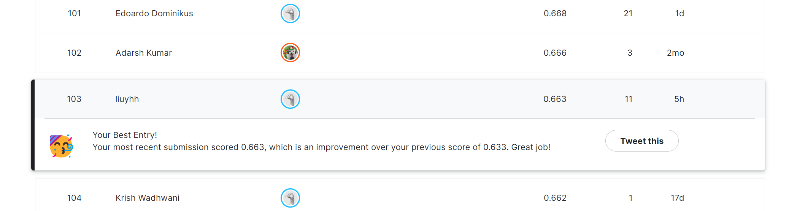

# Multi-view-Pig-Posture-Recognition
A robust fine-grained classification solution for real-world pig farm scenarios. Targeting common industrial pain points including occlusion, illumination variation, class imbalance, label noise and data leakage, this project builds a fully engineered computer vision system for intelligent pig health monitoring and behavioral analysis.

**🏆Competition Link**: https://www.kaggle.com/competitions/multi-view-pig-posture-recognition

## 🐷 Posture Classes Definition
| Class ID | Class Name | Description |
|---------|------------|-------------|
| 0 | Lateral_lying_left | Left Lying |
| 1 | Lateral_lying_right | Right Lying |
| 2 | Sitting | Sitting Posture |
| 3 | Standing | Standing Posture |
| 4 | Sternal_lying | Sternal Lying |
## ⚙️ Environment Dependencies
```txt
Python >= 3.8
pandas==1.5.3
numpy==1.24.3
torch==2.0.1
torchvision==0.15.2
timm==0.9.2
matplotlib==3.7.1
seaborn==0.12.2
opencv-python==4.7.0
Pillow==9.5.0
scikit-learn==1.2.2
```
## 📂 Project Structure
```txt
├── data/
│   ├── train1.csv
│   ├── train2.csv
│   ├── test.csv
│   ├── sample_submission.csv
│   ├── pig_posture_classes.txt
│   └── changes.csv
├── figures/                  # Data visualization outputs
├── pig_timm_resnet_attention_train.py   # Main training script
├── data_visualization.py     # Full data analysis & plotting
└── README.md
```
## 🔥Installation
```python
## git clone this repository
git clone https://github.com/isleep888/Multi-view-Pig-Posture-Recognition.git
cd resnet_pig_package

# create an environment with python >= 3.8
conda create -n pig-pose python=3.8
conda activate pig-pose
pip install -r requirements.txt
```

## 🔥Model Training & Inference
```python
python pig_timm_resnet_attention_train.py
```
The script automatically executes data cleaning, balanced sampling, group validation, 5-fold training, TTA inference and final submission file generation.

## 🔥Data Visualization & Analysis
```python

```

## 🏅 Competition Ranking
After comprehensive optimization including data cleaning, adaptive augmentation, Soft Isolation strategy and model ensemble, our final solution achieved a competitive ranking in the official Kaggle competition:
- Final Competition Ranking: Top 103 / 257
- Core Advantage: Stable generalization performance under complex real farm scenarios, effectively solving common industrial CV pain points
  



## Contact
Please feel free to contact: 202481313616@m.scnu.edu.cn. I am very pleased to communicate with you and will maintain this repository during my free time.

## ⭐ Star & Fork
If this repository helps your study or competition research, please star and fork this project. Continuous updates will be maintained!
